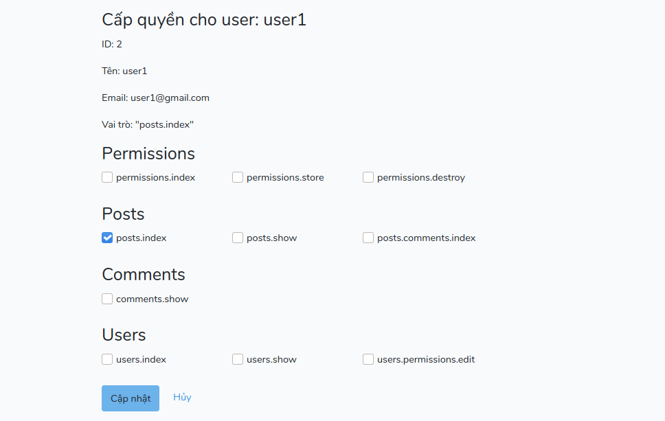

## Project
Mẫu đăng nhập sử dụng VueJS và laravel API. Xác thực JWT, phân quyền theo hành động.

## Chức năng chính
- Đăng nhập, đăng ký, quên mật khẩu với API laravel
- Phân quyền truy cập các api route cho từng user sử dụng laravel permission



## Cài đặt
```
# Trong thư mục Api(sử dụng laravel framework)
cd Api

# cài đặt các pakage
composer install

# Tạo key cho ứng dụng
php artisan key:generate

# Tạo bảng database và dữ liệu test
php artisan migrate --seed

# Sao chép file .env sau đó sửa các thông tin về database (mysql), email (mailtrap)
cp .env .env.example

# Tạo server block trên local, hoặc chạy lệnh:
php artisan serve

# Trong thư mục client
cd ../client

# Cài các thư viện dùng npm
npm install

# Mở file .env và sửa VUE_APP_API_URL thành địa chỉ server block của api
VUE_APP_API_URL=http://permission.test/api/

# Biên dịch và chạy project client
npm run serve
```
